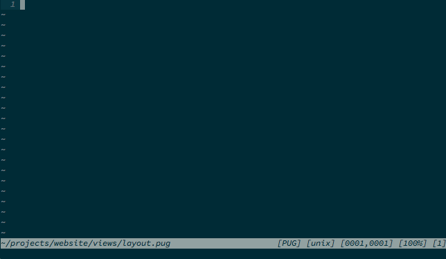

vim-pug-complete
================


Features
--------
Based on official htmlcomplete.vim plugin so it completes:
  - doctypes
  - tags & attributes & attribute values
  - fallback to javascript and css completions in related code portions
  - classes and ids ( collected from style., link & @import)

Plus html5.vim data:
  - html5 tags & attributes & attribute values
  - SVG elements
  - microdata.
  - RDFa.
  - WAI-ARIA.

Plus pug specific completions:
  - blocks
  - mixins

You could also use the following options to disable a specific attribute group:
```vim
let g:html5_event_handler_attributes_complete = 0 " Disable event-handler attributes
let g:html5_rdfa_attributes_complete = 0          " Disable RDFa attributes
let g:html5_microdata_attributes_complete = 0     " Disable microdata attributes
let g:html5_aria_attributes_complete = 0          " Disable WAI-ARIA attribute
```
Add to your `.vimrc` or filetype specific configuration `~/.vim/after/ftplugin/pug.vim`

Installation
------------
Use pathogen or plugin manager of your choise.

##### pathogen:
```bash
git clone https://github.com/dNitro/vim-pug-complete.git $HOME/.vim/bundle
```
##### Vundle:
```vim
Plugin 'dNitro/vim-pug-complete'
```
##### vim-plug:
```vim
Plug 'dNitro/vim-pug-complete', { 'for': ['jade', 'pug'] }
```

Usage
-----
Hit `<C-x><C-o>` in insert mode everywhere you expect something to popup

**OR**

Fire up your autocomplete plugin and start typing

Related
-------
Filetype detection, indentation and syntax highlighting:
  - [vim-pug](https://github.com/digitaltoad/vim-pug)

Credits
-------
  - [Mikolaj Machowski](https://github.com/vim/vim) - [Official htmlcomplete.vim plugin](https://github.com/vim/vim/blob/3a117e19e02bf29cfc5e398470dd7851ae3d6803/runtime/autoload/htmlcomplete.vim#L3)
  - [Wei-Ko Kao](https://github.com/othree) - [html5.vim plugin](https://github.com/othree/html5.vim)

License & Copyright
-------------------
[License](./LICENSE)

© 2016 Ali Zarifkar. All Rights Reserved.
